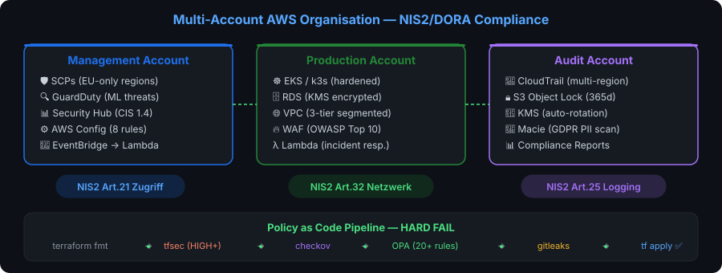

<!-- HEADER -->
<p align="center">
  
</p>

<p align="center">
  <a href="https://www.linkedin.com/in/lösungitservicezafarruzibaev"></a>
  <a href="mailto:z.ruzibaev@mail.de"></a>
  <a href="https://github.com/Ruzibaev007?tab=repositories"></a>
  <a href="https://github.com/Ruzibaev007/terraform-aws-security/releases"></a>
</p>

<p align="center">
  
  
  
  
  
  
</p>

---

## 🎯 Über mich

<table>
<tr>
<td width="60%">

Ich entwickle **Open-Source-Sicherheitsarchitekturen** für den deutschen Mittelstand, kritische Infrastrukturen (KRITIS) und EU-Unternehmen.

**Spezialisierung:**
- 🔐 **Compliance als Code** — NIS2, DORA, ISO 27001
- 🏗️ **Cloud-Architektur** — AWS Multi-Account, Azure KMU
- 🧬 **Post-Quantum-Kryptographie** — NIST PQC Migration
- ⚡ **DevSecOps** — CI/CD mit HARD FAIL Sicherheitsgate

</td>
<td width="40%">

```
  NIS2 + DORA + ISO 27001
          ↓
  Terraform + OPA/Rego
          ↓
  Kryptographie → PQC
  (AES → ML-KEM/SLH-DSA)
          ↓
  BSI / BaFin Meldung
```

</td>
</tr>
</table>

---

## 🏆 Aktuelle Projekte

<table>
<tr>
<td width="50%">

### 🔐 [terraform-aws-security](https://github.com/Ruzibaev007/terraform-aws-security)

[](https://github.com/Ruzibaev007/terraform-aws-security/releases)
[](https://github.com/Ruzibaev007/terraform-aws-security)

**NIS2 · DORA · ISO 27001 · BSI**

AWS Multi-Account Compliance-Framework mit 35+ Controls, Lambda Incident Response und automatisierter BSI-Meldung.

`Terraform` `OPA` `AWS` `Python` `Lambda`

</td>
<td width="50%">

### ☁️ [azure-kmu-vdi-lab](https://github.com/Ruzibaev007/azure-kmu-vdi-lab)

[](https://github.com/Ruzibaev007/azure-kmu-vdi-lab)
[](https://github.com/Ruzibaev007/azure-kmu-vdi-lab)

**Mittelstand · KMU · Azure**

VDI, CMDB, IAM/RBAC, ITSM und Security Monitoring — Referenzarchitektur für deutsche KMU.

`Azure` `Python` `FastAPI` `CMDB` `IAM`

</td>
</tr>
<tr>
<td width="50%">

### 📋 [nis2-infrastructure-documentation-kit](https://github.com/Ruzibaev007/nis2-infrastructure-documentation-kit)

[](https://github.com/Ruzibaev007/nis2-infrastructure-documentation-kit)

**Dokumentation · Compliance-Vorlagen**

NIS2 Netzwerkarchitektur, Sicherheitsbaselines und Enterprise-Vorlagen für deutsche und EU-Organisationen.

`Shell` `Docker` `Mermaid` `NIS2`

</td>
<td width="50%">

### 🐧 [linux-workstation-setup](https://github.com/Ruzibaev007/linux-workstation-setup)

[](https://github.com/Ruzibaev007/linux-workstation-setup)

**SysAdmin · Netzwerk · Linux Mint**

Workstation-Setup für Infrastruktur, Netzwerk und Systemadministration — Tools und Configs.

`Linux` `Shell` `Networking` `SysAdmin`

</td>
</tr>
</table>

---

## 🏗️ Architektur-Expertise

<p align="center">
  <a href="https://github.com/Ruzibaev007/terraform-aws-security">
    
  </a>
</p>

<p align="center"><i>Klicken Sie auf das Diagramm → zum Repository</i></p>

---

## 🛡️ Kompetenzprofil

<p align="center">
  
</p>

---

## 🔧 Technologie-Stack

<div align="center">

**Cloud & Infrastruktur**

[](https://github.com/Ruzibaev007/terraform-aws-security)
[](https://github.com/Ruzibaev007/azure-kmu-vdi-lab)
[](https://github.com/Ruzibaev007/terraform-aws-security)


**Container & Orchestrierung**


**DevSecOps & Compliance**


**Sprachen & Tools**


</div>

---

## 🔐 Kryptographie & Post-Quantum-Migration

<table>
<tr>
<td width="50%">

### ✅ Implementiert

| Verfahren | Technologie |
|-----------|-------------|
| Symmetrisch | AES-256-GCM |
| Schlüssel | AWS KMS (CMK, Rotation) |
| Transport | TLS 1.3 (mTLS) |
| Asymmetrisch | RSA-2048+, ECDSA P-384 |
| Hashing | SHA-256, SHA-3 |
| Signaturen | ECDSA, EdDSA |

</td>
<td width="50%">

### 🔄 Post-Quantum (in Vorbereitung)

| Standard | Algorithmus |
|----------|------------|
| FIPS 203 | **ML-KEM** (Kyber) |
| FIPS 204 | **ML-DSA** (Dilithium) |
| FIPS 205 | **SLH-DSA** (Sphincs+) |
| Hybrid | PQ + klassisch |
| Inventar | Krypto-Agilität |
| Roadmap | Migration bis 2030 |

</td>
</tr>
</table>

> 🧬 **Strategie:** Vorbereitung auf [NIST PQC-Standards](https://csrc.nist.gov/projects/post-quantum-cryptography). Migration von RSA/ECDSA auf gitterbasierte Algorithmen — Krypto-Agilität als Architekturprinzip.

---

## 🇩🇪 Compliance & Regulatorik

| Framework | Status | Anwendungsbereich | Referenz |
|-----------|:------:|-------------------|----------|
| **NIS2** (EU 2022/2555) | ✅ | KRITIS · Mittelstand · IT | [→ Repo](https://github.com/Ruzibaev007/terraform-aws-security/tree/main/compliance/nis2) |
| **DORA** (EU 2022/2554) | ✅ | Banken · Versicherungen | [→ Repo](https://github.com/Ruzibaev007/terraform-aws-security/tree/main/compliance/dora) |
| **ISO 27001:2022** | ✅ | 35+ Controls | [→ Mapping](https://github.com/Ruzibaev007/terraform-aws-security/blob/main/docs/compliance-mapping.md) |
| **BSI IT-Grundschutz** | ✅ | ORP.4 · CON.1 · DER.2.1 | [→ Docs](https://github.com/Ruzibaev007/terraform-aws-security/tree/main/docs) |
| **TISAX** (VDA ISA 6.0) | ✅ | Automobilzulieferer | [→ Beispiel](https://github.com/Ruzibaev007/terraform-aws-security/tree/main/examples/automotive) |
| **DSGVO** | ✅ | EU-Datenresidenz | eu-central-1 |
| **BSI TR-02102** | ✅ | Kryptographie | AES-256 + KMS |
| **NIST PQC** | 🔄 | Post-Quantum | FIPS 203/204/205 |

---

## 🎯 Zielgruppen

<table>
<tr>
<th>🏭 Mittelstand</th>
<th>🏥 KRITIS</th>
<th>🏦 Finanzsektor</th>
</tr>
<tr>
<td>

- Fertigung & Maschinenbau
- Automobilzulieferer
- IT-Dienstleister
- Software-Unternehmen

</td>
<td>

- Krankenhäuser & Pharma
- Energie & Stadtwerke
- Wasser / Abwasser
- Telekommunikation

</td>
<td>

- Banken & Sparkassen
- Versicherungen
- Investmentfirmen
- Zahlungsdienste

</td>
</tr>
</table>

---

## 📋 Automatisierte Meldepflichten

<table>
<tr>
<th>Vorfall</th>
<th>⏱️ Frist</th>
<th>🏛️ Behörde</th>
<th>⚙️ Implementierung</th>
</tr>
<tr><td><b>NIS2</b> Erstmeldung</td><td><code>24 h</code></td><td>BSI</td><td>Lambda + SNS + EventBridge</td></tr>
<tr><td><b>NIS2</b> Vollmeldung</td><td><code>72 h</code></td><td>BSI</td><td>Step Functions Workflow</td></tr>
<tr><td><b>NIS2</b> Abschluss</td><td><code>1 Monat</code></td><td>BSI</td><td>Automatisierte Berichterstattung</td></tr>
<tr><td><b>DORA</b> Erstmeldung</td><td><code>4 h</code></td><td>BaFin</td><td>Step Functions + Klassifizierung</td></tr>
<tr><td><b>DORA</b> Zwischenbericht</td><td><code>72 h</code></td><td>BaFin</td><td>Workflow-Automatisierung</td></tr>
<tr><td><b>DORA</b> Abschluss</td><td><code>1 Monat</code></td><td>BaFin</td><td>Vollständiger Audit-Trail</td></tr>
</table>

---

## 📫 Kontakt & Zusammenarbeit

<div align="center">

**Verfügbar für:** Beratung · Festanstellung · Open-Source-Mitwirkung

[](mailto:z.ruzibaev@mail.de)
[](https://www.linkedin.com/in/lösungitservicezafarruzibaev)
[](https://github.com/Ruzibaev007?tab=repositories)

---

*Sichere Infrastruktur für die EU. Open Source. NIS2-konform. Post-Quantum-ready.*

</div>
